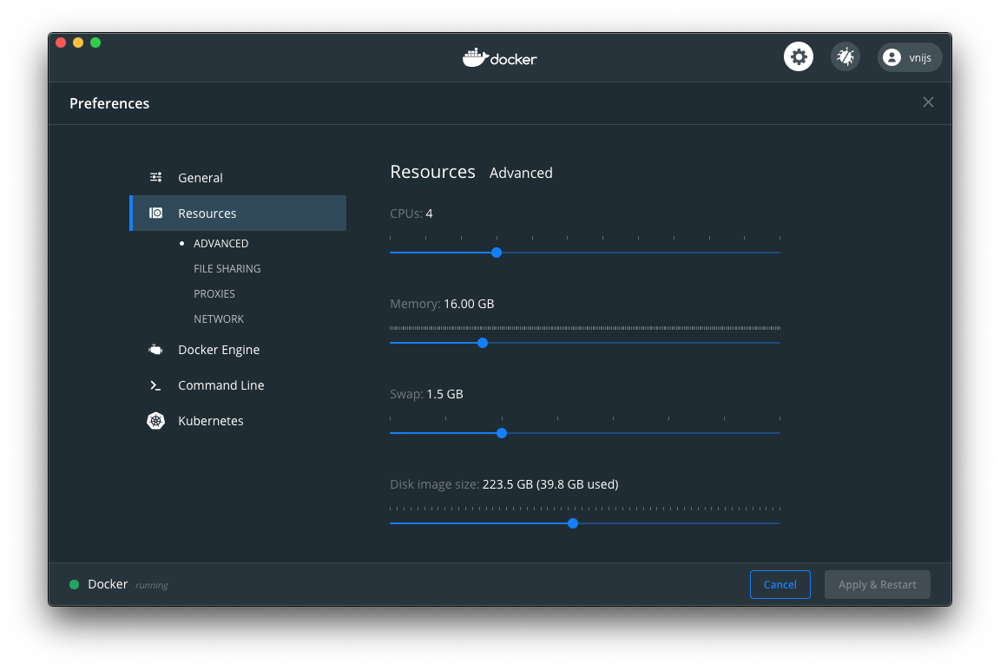
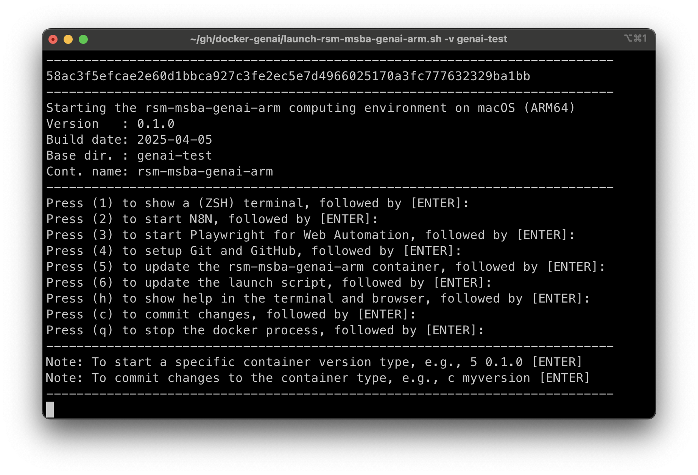

# Contents

- [Installing the RSM-MSBA-GENAI-ARM computing environment on macOS systems with and ARM chip (e.g., M3)](#installing-the-rsm-msba-genai-arm-computing-environment-on-macos-systems-with-an-ARM-chip)
- [Updating the RSM-MSBA-GENAI-ARM computing environment on macOS systems with an ARM chip](#updating-the-rsm-msba-genai-arm-computing-environment-on-macos-systems-with-an-ARM-chip)
- [Using VS Code](#using-vs-code)
- [Installing Python Packages locally](#installing-python-and-r-packages-locally)
- [Committing changes to the computing environment](#committing-changes-to-the-computing-environment)
- [Getting help](#getting-help)
- [Trouble shooting](#trouble-shooting)
- [Optional](#optional)

## Installing the RSM-MSBA-GENAI-ARM computing environment on macOS systems with an ARM chip (e.g., M3, M4, etc.)

Please follow the instructions below to install the rsm-msba-genai-arm computinglenvironment. It has Python, Postgres, UV, etc. pre-installed. The computing environment will be consistent across all students and faculty, easy to update, and also easy to remove if desired (i.e., there will *not* be dozens of pieces of software littered all over your computer).

**Step 1**: Install docker from the link below and make sure it is running. You will know it is running if you see the icon below at the top-right of your screen. If the containers in the image are moving up and down docker hasn't finished starting up yet.


[download docker for macOS with an ARM chip (e.g., M3, M4, etc.)](https://desktop.docker.com/mac/stable/arm64/Docker.dmg)

You should change the (maximum) resources docker is allowed to use on your system. We recommend you set this to approximately 50% of the maximum available on your system.



You should also go to the "Advanced" tab and configure the installation of the Command Line Interface (CLI). Set it to "System" as shown in the screenshot below and click on the "Apply & Restart".


Optional: If you are interested, the linked video gives a brief intro to what Docker is: https://www.youtube.com/watch?v=YFl2mCHdv24

**Step 2**: Open a terminal and copy-and-paste the code below

You will need the macOS command line developer tools for the next steps. Follow the prompts until the software is installed.

```bash
xcode-select --install;
```

**Step 3**: Now copy-and-paste the code below and run it in iTerm (macOS) or an Ubuntu shell (Windows)

```bash
git clone https://github.com/radiant-ai-hub/docker-genai.git ~/git/docker-genai;
echo 'alias launch="~/git/docker-genai/launch-rsm-msba-genai-arm.sh -v ~"' >> ~/.zshrc;
source ~/.zshrc;
```

Now you should be able to use `launch` to start the docker container, connected to your home directory on macOS. You can exit the menu that should be shown with q + Enter. 

```bash
cd ~;
launch;
```

This step will clone and start up a script that will finalize the installation of the computing environment. The first time you run this script it will download the latest version of the computing environment which can take some time. Wait for the container to download and follow any prompts. Once the download is complete you should see a menu as in the screenshot below.



**Step 4**: Finalize setup

To finalize the setup, open a terminal inside the docker container by pressing `1` and `Enter` in the launch menu. Then run the command below:

```bash
setup;
exit;
```

## Updating the RSM-MSBA-GENAI-ARM computing environment on macOS systems with an ARM chip

To update the container use the launch script and press 5 (+ Enter). To update the launch script itself, press 6 (+ Enter).


If for some reason you are having trouble updating either the container or the launch script open a terminal and copy-and-paste the code below. These commands will update the docker container, replace the old docker related scripts, and copy the latest version of the launch script to your Desktop.

```bash
docker pull vnijs/rsm-msba-genai-arm;
rm -rf ~/git/docker*;
git clone https://github.com/radiant-ai-hub/docker-genai.git ~/git/docker-genai;
echo 'alias launch="~/git/docker-genai/launch-rsm-msba-genai-arm.sh -v ~"' >> ~/.zshrc;
source ~/.zshrc;
```

## Using VS Code

Microsoft's open-source integrated development environment (IDE), VS Code or Visual Studio Code, was the most popular development environment according to a [Stack Overflow developer survey](https://survey.stackoverflow.co/2022#section-most-popular-technologies-integrated-development-environment). VS Code is widely used by Google developers and is the [default development environment at Facebook](https://www.zdnet.com/article/facebook-microsofts-visual-studio-code-is-now-our-default-development-platform/).

VS Code can be installed from the link below and is an excellent, and very popular, editor for Python and many other programming languages.

<a href="https://code.visualstudio.com/download" target="_blank">https://code.visualstudio.com/download</a>

Run the code below from a terminal on macOS after installing VS Code to install relevant extensions:

```bash
cd ~/git/docker-genai/vscode;
./extension-install.sh;
cd -;
```

If you get a "code: command not found" error when trying to launch VS Code from a terminal, follow the instructions below to add VS Code to your path:

<https://code.visualstudio.com/docs/setup/mac#_launching-from-the-command-line>

To learn more about using VS Code to write python code see the links and comments below.

- <a href="https://code.visualstudio.com/docs/languages/python" target="_blank">Python in VS Code</a>
- <a href="https://code.visualstudio.com/docs/python/python-tutorial#_create-a-python-hello-world-source-code-file" target="_blank">VS Code Python Tutorial</a>

Note that you can use `Shift+Enter` to run the current line in a Python Interactive Window:

- <a href="https://code.visualstudio.com/docs/python/jupyter-support-py" target="_blank">Executing Python Code in VS Code</a>

When writing and editing python code you will have access to tools for auto-completion, etc. Your code will also be auto-formatted every time you save it using the "black" formatter.

- <a href="https://code.visualstudio.com/docs/python/editing" target="_blank">Editing Python in VS Code Python</a>

VS Code also gives you access to a debugger for your python code. For more information see the link below:

- <a href="https://code.visualstudio.com/docs/python/debugging" target="_blank">Debugging Python in VS Code Python</a>

You can even open and run Jupyter Notebooks in VS Code

- <a href="https://code.visualstudio.com/docs/datascience/jupyter-notebooks" target="_blank">Jupyter Notebooks in VS Code</a>

## Setting up your Python environment

Initialize the environment in a project directory, e.g., ~/git/myproject:

```bash
uv init ~/git/myproject
```

Create a virtual environment with Python 3.12.7 where you can install packages specifically for your project:

```bash
cd ~/git/myproject
uv venv --python 3.12.7
```

Once you have the basic setup done using the code chunk above you should be able to add python packages. The `pyrsm` packages will install several dependencies that you will likely need (e.g., sklearn, pandas, ipykernel, etc.).

```bash
uv add pyrsm
```

Common UV commands for managing packages are listed below. Note that these will give directory specific results:

```bash
uv add <package-name>    # Install a package
uv remove <package-name> # Remove a package
uv pip list              # List installed packages in current directory
uv run python-file.py    # Run a Python file using the virtual environment
```

For more information about UV:

* <https://www.youtube.com/watch?v=qh98qOND6MI>
* <https://www.datacamp.com/tutorial/python-uv>
* <https://github.com/astral-sh/uv>

Add UV shell completions (optional but recommended):

```bash
echo 'eval "$(uv generate-shell-completion zsh)"' >> ~/.rsm-msba/zsh/.zshrc
```

## Cleanup

You should always stop the `rsm-msba-genai-arm` docker container using `q` (+ Enter) in the launch menu. If you want a full cleanup and reset of the computational environment on your system, however, execute the following commands from a (bash) terminal to (1) remove local R and Python packages, (2) remove all docker images, networks, and (data) volumes, and (3) 'pull' only the docker image you need (e.g., rsm-msba-genai-arm):

```bash
rm -rf ~/.rsm-msba;
docker system prune --all --volumes --force;
docker pull vnijs/rsm-msba-genai-arm;
```

## Getting help

Please bookmark this page in your browser for easy access in the future. You can also access the documentation page for your OS by typing h (+ Enter) in the launch menu. Note that the launch script can also be started from the command line (i.e., a bash terminal) and has several important arguments:

* `launch -t 0.1.0` ensures a specific version of the docker container is used. Suppose you used version 0.1.0 for a project. Running the launch script with `-t 0.1.0` from the command line will ensure your code still runs, without modification, years after you last touched it!
* `launch -s` show additional output in the terminal that can be useful to debug any problems
* `launch -h` prints the help shown in the screenshot below


## Trouble shooting

The only issues we have seen on macOS so far can be addressed by restarting docker and/or restarting your computer

## Optional

If you want to make your terminal look nicer and add syntax highlighting, auto-completion, etc. follow the install instructions linked below:

<https://github.com/radiant-ai-hub/docker-genai/blob/main/install/setup-ohmyzsh.md>


To install a more feature-rich terminal for macOS see: <https://iterm2.com?
