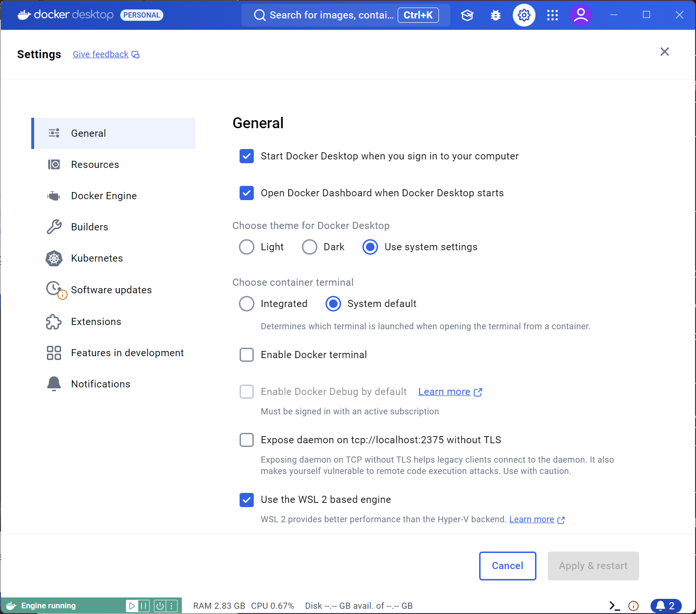
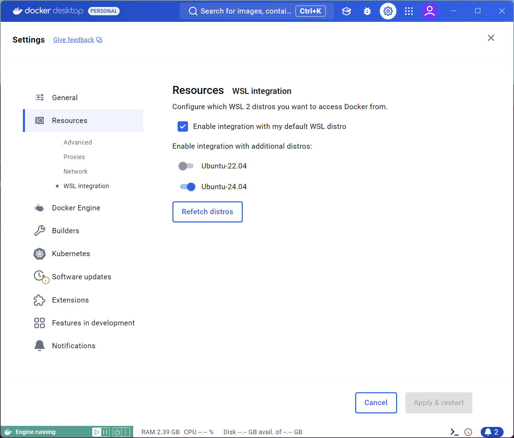
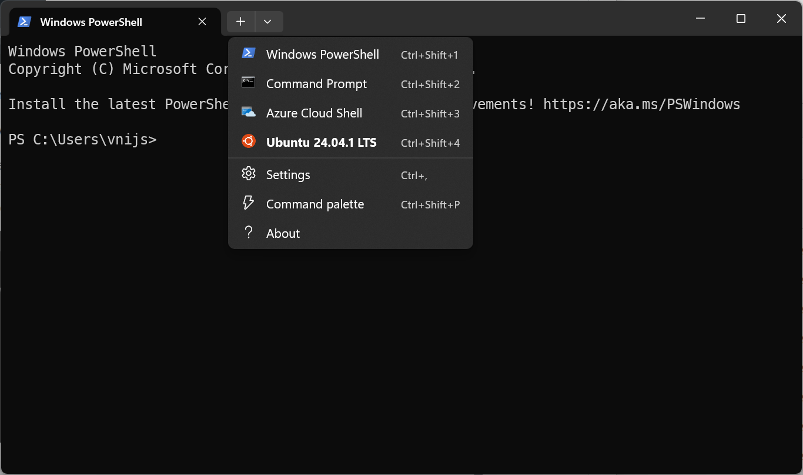
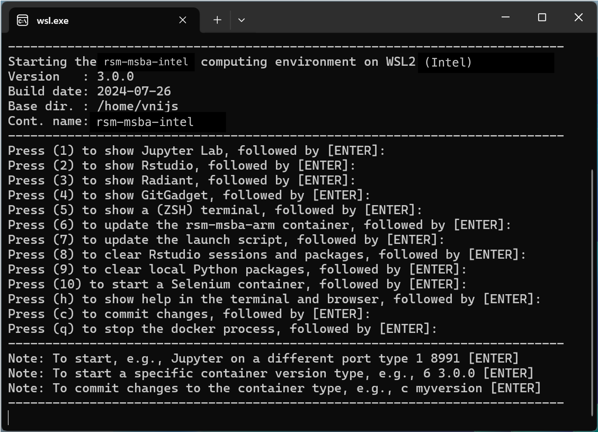
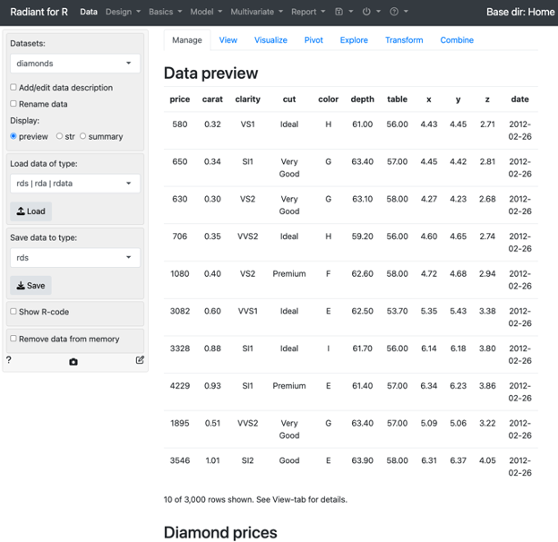
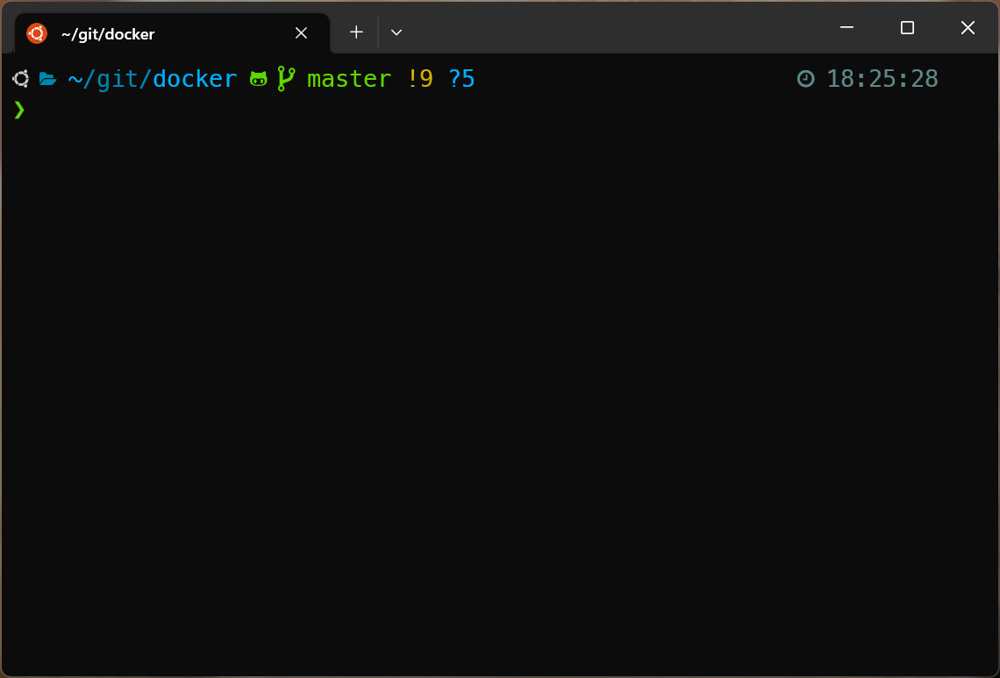

# Contents

- [Installing the RSM-MSBA-GENAI-INTEL computing environment on Windows](#installing-the-rsm-msba-genai-intel-computing-environment-on-windows)
- [Updating the RSM-MSBA-GENAI-INTEL computing environment on Windows](#updating-the-rsm-msba-genai-intel-computing-environment-on-windows)
- [Using VS Code](#using-vs-code)
- [Installing Python packages locally](#installing-python-and-r-packages-locally)
- [Committing changes to the computing environment](#committing-changes-to-the-computing-environment)
- [Getting help](#getting-help)
- [Trouble shooting](#trouble-shooting)
- [Optional](#optional)

## Installing the RSM-MSBA-GENAI-INTEL computing environment on Windows

Please follow the instructions below to install the rsm-msba-genai-intel computing environment. It has Python, R, Radiant, Postgres, Spark and various required packages pre-installed. The computing environment will be consistent across all students and faculty, easy to update, and also easy to remove if desired (i.e., there will *not* be dozens of pieces of software littered all over your computer).

**Step 1**: Upgrade Windows

Windows users must use Microsoft Windows 11, or Windows 10 Professional, Education, or Enterprise (64-bit). Check if there are any updates available for your system by clicking on the Start icon and typing "Check for Updates". After upgrading to the latest version of Windows, open PowerShell and type `winver`.

**Step 2**: Install Windows Subsystem for Linux (WSL2)

To activate WSL2, start PowerShell as an administrator and copy-and-paste the code below:

```bash
dism.exe /online /enable-feature /featurename:Microsoft-Windows-Subsystem-Linux /all /norestart
```
Followed by:

```bash
dism.exe /online /enable-feature /featurename:VirtualMachinePlatform /all /norestart;
```

Next, restart your computer and re-open PowerShell as a regular user to install Ubuntu. You will be asked to provide a username and password during the install process.

```bash
wsl --set-default-version 2
wsl --install -d Ubuntu-24.04
```

> Important: Make sure to enter the same username and password you use to login to your computer. The username should **not** have any spaces or special characters.

Check your username for Windows and Ubuntu by executing the command below in both (1) a Windows PowerShell and (2) an Ubuntu terminal. The output in both cases should be the same.

```bash
whoami
```

> Important: If you see `root` as the username please review the discussion in **step 4** below. You will need to reset your username for WSL2.

Next, restart your computer and re-open PowerShell to check that Ubuntu is set as the default linux distribution:

```bash
wsl --list
```

This should return the below:

```bash
PS C:\WINDOWS\system32> wsl --list
Windows Subsystem for Linux Distributions:
Ubuntu-24.04 (Default)
docker-desktop-data
docker-desktop
```

If Ubuntu is not set as the default linux distribution, update the default setting and double check that it is now correct

```bash
wsl --setdefault Ubuntu-24.04
wsl --list
```

**Step 3**: Install Windows Tools

Download and install the Microsoft <a href="https://www.microsoft.com/en-us/p/app-installer/9nblggh4nns1?activetab=pivot:overviewtab" target="_blank">App Installer</a>. After completing the install, open a new PowerShell terminal **as a regular user** and enter the commands below:

```bash
winget install -e Docker.DockerDesktop;
```

This will install Docker Desktop. If you are using Windows 10, you should also install Windows Terminal and VS Code using the command below. Windows Terminal and VS Code are available by default on Windows 11. We recommend you pin Windows Terminal and VS Code to the taskbar as you will use these tools regularly.

```bash
winget install -e Microsoft.VisualStudioCode;
winget install -e Microsoft.WindowsTerminal;
```

Next, logout and back into Windows and then start Docker by clicking on the Whale icon that was added to your desktop (see image below).


You will know if Docker is running if you see the icon above in your system tray. If the containers shown in the image are moving up and down, docker hasn't finished starting up yet. Once the docker application is running, click on the docker icon in the system tray and select "Settings".

Start by clicking on _General_ to ensure "Use the WSL 2 based engine" is checked as in the screenshot below.



Next click on _Resources > WSL INTEGRATION_ and ensure integration with Ubuntu is enabled as in the screenshot below



Optional: If you are interested, this linked video gives a brief intro to what Docker is: https://www.youtube.com/watch?v=YFl2mCHdv24

**Step 4**: Open an Ubuntu terminal to complete RSM-MSBA-GENAI-INTEL environment setup

If you are using Windows Terminal you can click on the down-caret at the top of the window to start an Ubuntu terminal as shown in the screenshot below. Alternatively, you can click on the Windows Start icon and type "ubuntu" to start an Ubuntu terminal. Copy-and-paste the code below into the Ubuntu terminal and provide your password when prompted.



```bash
cd ~; sudo -- sh -c 'apt -y update; apt -y upgrade; apt -y install xdg-utils wslu zsh ntpdate python-is-python3; ntpdate pool.ntp.org'
```

Now Ubuntu should be up to date and ready to accept commands to clone the docker repo with documentation and launch scripts. Again, provide your password if prompted.

```bash
git clone https://github.com/radiant-ai-hub/docker-genai.git ~/git/docker-genai;
echo 'alias launch="~/git/docker-genai/launch-rsm-msba-genai-arm.sh -v ~"' >> ~/.zshrc;
source ~/.zshrc;
```

Now you should be able to use `launch` to start the docker container, connected to your home directory in Ubuntu 24.04. You can exit the menu that should be shown with q + Enter. 

```bash
cd ~;
launch;
```

Next, determine your Windows username by running the code below from an Ubuntu terminal:

```bash
USERNAME=$(powershell.exe '$env:UserName'|tr -d '\r');
echo $USERNAME;
```

Finally, we will create and launch a script `launch-rsm-msba.bat` on your Desktop that you can double-click to start the container in the future. 

The code below will try to determine if you have a Desktop folder that is Backed-Up to OneDrive. 

```bash
if [ -d "/mnt/c/Users/$USERNAME/OneDrive/Desktop/" ]; then
  echo "Using Desktop backed up in OneDrive" >&2
  DTOP="/OneDrive/Desktop";
elif [ -d "/mnt/c/Users/$USERNAME/Desktop/" ]; then
  echo "Using Desktop folder in user home directory" >&2
  DTOP="/Desktop";
else
  DTOP="";
fi
if [ -n "$DTOP" ]; then
  echo "wt.exe wsl.exe ~/git/docker-genai/launch-rsm-msba-genai-intel.sh -v ~" > /mnt/c/Users/"$USERNAME$DTOP"/launch-rsm-msba.bat;
  chmod 755 /mnt/c/Users/"$USERNAME$DTOP"/launch-rsm-msba.bat;
  cd ~;
  ln -s /mnt/c/Users/"$USERNAME$DTOP"/ ./Desktop;
  /mnt/c/Users/"$USERNAME$DTOP"/launch-rsm-msba.bat;
else
  echo "Unable to determine location of Desktop folder on your system" >&2
  echo "The .bat file has been added to your home directory in Ubuntunu" >&2
  echo "wt.exe wsl.exe ~/git/docker-genai/launch-rsm-msba-genai-intel.sh -v ~" > /mnt/c/Users/"$USERNAME"/launch-rsm-msba.bat;
  chmod 755 /mnt/c/Users/"$USERNAME"/launch-rsm-msba.bat;
fi
ln -s /mnt/c/Users/"$USERNAME"/Dropbox ./Dropbox;
ln -s /mnt/c/Users/"$USERNAME"/Downloads ./Downloads;
ln -s "/mnt/c/Users/$USERNAME/Google Drive" "./Google Drive";
ln -s /mnt/c/Users/"$USERNAME"/OneDrive ./OneDrive;
ln -s /mnt/c/Users/"$USERNAME" ./win_home;
```

The created and launched script will finalize the installation of the computing environment. The first time you run this script it will download the latest version of the computing environment which can take some time. Wait for the image to download and follow any prompts. Once the download is complete you should see a menu as in the screen shot below.



**Trouble shooting**

If you see `Base dir.: /root` as shown in the image below there was an issue creating a new user at the beginning of Step 4. 


From an Ubuntu terminal run the below but replace “your-id” by the id you want to use.

```bash
adduser your-id
sudo usermod -aG sudo your-id
```

Now, from a Powershell terminal run the below where, again, you should replace "your-id" by the appropriate id:

```powershell
ubuntu2404 config --default-user your-id
```

Next, re-run the code from Step 4 above, starting with the command:

```bash
git clone https://github.com/radiant-ai-hub/docker-genai.git ~/git/docker;
```

**Step 4**: Check that you can launch Radiant

You will know that the installation was successful if you can start Radiant. If you press 2 (+ Enter) Radiant should start up in your default web browser.

> Important: Always use q (+ Enter) to shutdown the computing environment



To finalize the setup, open a terminal inside the docker container by pressing `1` and `Enter` in the launch menu. Then run the command below:

```bash
setup;
exit;
```

## Updating the RSM-MSBA-GENAI-INTEL computing environment on Windows

To update the container use the launch script and press 6 (and Enter). To update the launch script itself, press 7 (and Enter).


If for some reason you are having trouble updating either the container or the launch script open an Ubuntu terminal and copy-and-paste the code below. Note: You may have to right-click to get a copy-and-paste menu for the terminal. These commands will update the docker container, replace the old docker related scripts, and copy the latest version of the launch script to your Desktop.

```bash
docker pull vnijs/rsm-msba-genai-intel;
rm -rf ~/git/docker*;
git clone https://github.com/radiant-ai-hub/docker-genai.git ~/git/docker-genai;
echo 'alias launch="~/git/docker-genai/launch-rsm-msba-genai-arm.sh -v ~"' >> ~/.zshrc;
source ~/.zshrc;
```

## Using VS Code

Microsoft's open-source integrated development environment (IDE), VS Code or Visual Studio Code, was the most popular development environment according to a [Stack Overflow developer survey](https://survey.stackoverflow.co/2022#section-most-popular-technologies-integrated-development-environment). VS Code is widely used by Google developers and is the [default development environment at Facebook](https://www.zdnet.com/article/facebook-microsofts-visual-studio-code-is-now-our-default-development-platform/).

Run the code below from a PowerShell terminal after installing VS Code to install relevant extensions:

```powershell
Invoke-WebRequest -Uri https://raw.githubusercontent.com/radiant-ai-hub/docker-genai/master/vscode/extensions.txt -OutFile extensions.txt; 
cat extensions.txt |% { code --install-extension $_ --force};
del extensions.txt;
```

To learn more about using VS Code to write python code see the links and comments below.

- <a href="https://code.visualstudio.com/docs/languages/python" target="_blank">Python in VS Code</a>
- <a href="https://code.visualstudio.com/docs/python/python-tutorial#_create-a-python-hello-world-source-code-file" target="_blank">VS Code Python Tutorial</a>

Note that you can use `Shift+Enter` to run the current line in a Python Interactive Window:

- <a href="https://code.visualstudio.com/docs/python/jupyter-support-py" target="_blank">Executing Python Code in VS Code</a>

When writing and editing python code you will have access to tools for auto-completion, etc. Your code will also be auto-formatted every time you save it using the "black" formatter.

- <a href="https://code.visualstudio.com/docs/python/editing" target="_blank">Editing Python in VS Code Python</a>

VS Code also gives you access to a debugger for your python code. For more information see the link below:

- <a href="https://code.visualstudio.com/docs/python/debugging" target="_blank">Debugging Python in VS Code Python</a>

You can even open and run Jupyter Notebooks in VS Code

- <a href="https://code.visualstudio.com/docs/datascience/jupyter-notebooks" target="_blank">Jupyter Notebooks in VS Code</a>

## Setting up your Python environment

Initialize the environment in a project directory, e.g., ~/git/myproject:

```bash
uv init ~/git/myproject
```

Create a virtual environment with Python 3.12.7 where you can install packages specifically for your project:

```bash
cd ~/git/myproject
uv venv --python 3.12.7
```

Once you have the basic setup done using the code chunk above you should be able to add python packages. The `pyrsm` packages will install several dependencies that you will likely need (e.g., sklearn, pandas, ipykernel, etc.).

```bash
uv add pyrsm
```

Common UV commands for managing packages are listed below. Note that these will give directory specific results:

```bash
uv add <package-name>    # Install a package
uv remove <package-name> # Remove a package
uv pip list              # List installed packages in current directory
uv run python-file.py    # Run a Python file using the virtual environment
```

For more information about UV:

* <https://www.youtube.com/watch?v=qh98qOND6MI>
* <https://www.datacamp.com/tutorial/python-uv>
* <https://github.com/astral-sh/uv>

Add UV shell completions (optional but recommended):

```bash
echo 'eval "$(uv generate-shell-completion zsh)"' >> ~/.rsm-msba/zsh/.zshrc
```

## Cleanup

You should always stop the `rsm-msba-genai-arm` docker container using `q` (+ Enter) in the launch menu. If you want a full cleanup and reset of the computational environment on your system, however, execute the following commands from a (bash) terminal to (1) remove local R and Python packages, (2) remove all docker images, networks, and (data) volumes, and (3) 'pull' only the docker image you need (e.g., rsm-msba-genai-arm):

```bash
rm -rf ~/.rsm-msba;
docker system prune --all --volumes --force;
docker pull vnijs/rsm-msba-genai-intel;
```

## Getting help

Please bookmark this page in your browser for easy access in the future. You can also access the documentation page for your OS by typing h (+ Enter) in the launch menu. Note that the launch script can also be started from the command line (i.e., a bash terminal) and has several important arguments:

* `launch -t 0.1.0` ensures a specific version of the docker container is used. Suppose you used version 0.1.0 for a project. Running the launch script with `-t 0.1.0` from the command line will ensure your code still runs, without modification, years after you last touched it!
* `launch -s` show additional output in the terminal that can be useful to debug any problems
* `launch -h` prints the help shown in the screenshot below


## Trouble shooting

If there is an error related to the firewall, antivirus, or VPN, try turning them off to check if you can now start up the container. You should not be without a virus checker or firewall however! We recommend using **Windows Defender**. If you are not sure if Windows Defender is correctly configured, please check with IT.

Alternative "fixes" that have worked, are to restart docker by right-clicking on the "whale" icon in the system tray and/or restart your computer. It is best to quit any running process before you restart your computer (i.e., press q and Enter in the launch menu)

## Optional

If you want to make your terminal look nicer and add syntax highlighting, auto-completion, etc. follow the install instructions linked below:

<https://github.com/radiant-ai-hub/docker-genai/blob/main/install/setup-ohmyzsh.md>


