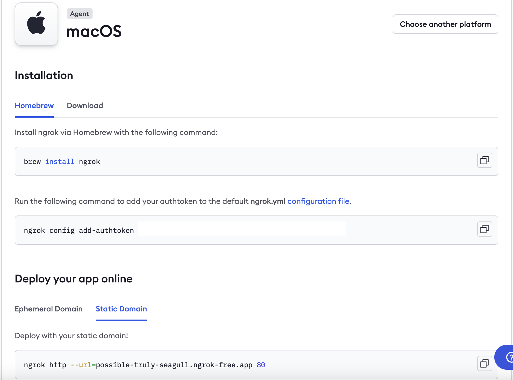
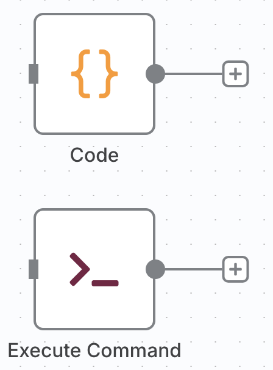
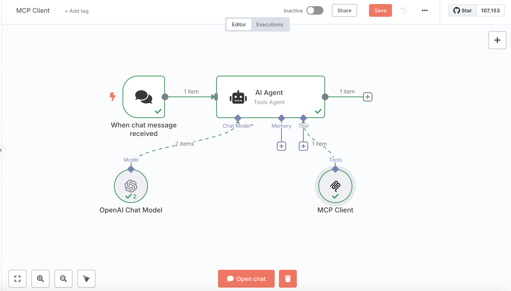
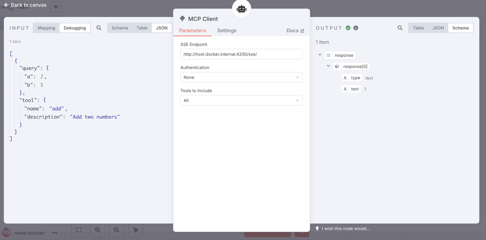
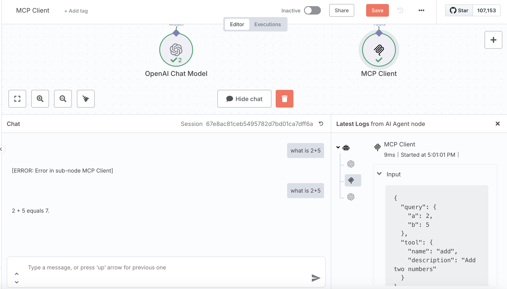

# n8n with Python Support

This repository contains a Docker setup for running n8n workflow automation with Python support. The setup includes:

- Latest n8n version
- Python 3.11
- pyrsm package
- n8n-nodes-python module for Python integration
- MCP support

## 📋 Requirements

- Docker and Docker Compose installed on your system
- Docker with AMD64 support (Intel Mac or AMD64 Linux)
- Internet connection for building the image

## 🚀 Quick Start

1. Clone this repository or download the Dockerfile and docker-compose.yml
2. Run the following command to start n8n:

```bash
docker compose build --no-cache
docker compose up -d
```

These commands first build the docker image using the Dockerfile and docker-compose.yaml files and then instantiates the image by creating a container.

Next, create a `.env` file and put the following contents inside it:

```bash

DOMAIN_NAME=ngrok-free.app
SUBDOMAIN=YOUR_SUBDOMAIN

GENERIC_TIMEZONE=UTC

# The email address to use for the TLS/SSL certificate creation
SSL_EMAIL=user@example.com

POSTGRES_USER=root
POSTGRES_PASSWORD=password
POSTGRES_DB=n8n

N8N_ENCRYPTION_KEY=super-secret-key
N8N_USER_MANAGEMENT_JWT_SECRET=even-more-secret
```

To host the local n8n workflow online so it can be accessed using Google Sheets and other online tools, go to https://ngrok.com/ and create a free account. Then install ngrok via Homebrew if on Mac:

```bash
brew install ngrok
```

Next, run the following command to add the ngrok authtoken into your system:

```bash
ngrok config add-authtoken <REPLACE WITH YOUR AUTHTOKEN>
```

Finally, run this command to port-forward your local port to the ngrok static domain:

```bash
ngrok http --url=<YOUR NGROK STATIC DOMAIN> 5678
```

Note that your Static domain url will be in this format: `SUBDOMAIN.DOMAIN_NAME`. Further instructions on ngrok can be found at your ngrok account under Setup & Installation, see the screenshot below as an example how this page in ngrok will look like:



To stop your n8n docker container run:

```bash
docker compose down
```

3. Access the n8n web interface at `http://localhost:5678`. You can also access the n8n online at `https://SUBDOMAIN.DOMAIN_NAME` which in the above screenshot example would be `https://possible-truly-seagull.ngrok-free.app`. (`SUBDOMAIN=possible-truly-seagull`, and `DOMAIN_NAME=ngrok-free.app`)

## 🛠️ Configuration

### Environment Variables

You can configure the setup using the following environment variables in the docker-compose.yml file:

- `USER`: Set to `node` for better security (recommended)
- `NODE_ENV`: Set to `production` for production use
- `N8N_ENCRYPTION_KEY`: Secret key for encrypting credentials (change this!)
- `GENERIC_TIMEZONE`: Set your preferred timezone (e.g., UTC, America/New_York)

### Volumes

The setup uses a Docker volume to persist your n8n data:

- `n8n_data`: Stores workflows, credentials, and other n8n data

## 🔧 Using Python in n8n

Once n8n is running, you can use Python in your workflows as follows:

1. Create a new workflow in the n8n web interface
2. Add a "code" node (search for "code" in the nodes panel) or "Exec Command" node. See below screenshot:


3. Write your Python code in the script editor
4. Your Python environment has access to:
   - Python 3.11 standard libraries
   - UV package manager (installed system-wide)
   - pyrsm package
   - Other Python libraries installed via pip

Example Python script to test your environment:

```python
import sys
import platform

# Test if UV and pyrsm are available
try:
    import pyrsm
    pyrsm_available = True
except ImportError:
    pyrsm_available = False

# Return information about the Python environment
print(
    "python_version": sys.version,
    "platform": platform.platform(),
    "pyrsm_available": pyrsm_available
)
```

## 🔧 Using MCP in n8n
Model Context Protocol (MCP) allows n8n to connect to external services and tools through a standardized protocol. This setup includes MCP support for enhanced workflow automation capabilities.

### What is MCP?

MCP (Model Context Protocol) is a protocol that enables secure connections between host applications and external services, allowing for data exchange and tool execution. In n8n, MCP can be used to:

- Connect to external APIs and services
- Execute remote tools and functions
- Access external data sources
- Integrate with AI models and services

## Setting up MCP in n8n

N8N has both MCP Client and MCP Server nodes. You may create your own MCP server in N8N and then connect it to a MCP Client in N8N or you may just use MCP client to connect to any MCP server. Here is the general process:

1. **Access MCP Nodes**: In the n8n workflow editor, search for "MCP" in the nodes panel
2. **Add MCP Client Node**: Drag the MCP Client node into your workflow
3. **Configure Connection**: Set up the connection parameters:
   - **Server URL or SSE Endpoint**: The URL of your MCP server (e.g., `http://localhost:8001`)
   - **Protocol**: Usually `http` or `https` or `sse`.
   - **Authentication**: Configure any required authentication if needed.

## 🏗️ Building a Local MCP Server with FastMCP

FastMCP is a Python framework for building MCP servers quickly and easily. Here's how to create and run an MCP server inside your n8n container.

### Step 1: Install FastMCP in the Container

Access the running n8n container and install FastMCP:

```bash
# Access the container
docker exec -it n8n-python bash

# Install FastMCP and dependencies
pip install fastmcp uvicorn
```

### Step 2: Create a Simple MCP Server

Create a new MCP server file inside the container:

```bash
# Create a directory for MCP servers
mkdir -p /home/node/mcp-servers
cd /home/node/mcp-servers

# Create the server file
cat > demo_mcp_server.py << 'EOF'
# server.py
from fastmcp import FastMCP

# Create an MCP server
mcp = FastMCP("Demo")

# Add an addition tool
@mcp.tool()
def add(a: int, b: int) -> int:
    """Add two numbers"""
    return a + b

# Add a dynamic greeting resource
@mcp.resource("greeting://{name}")
def get_greeting(name: str) -> str:
    """Get a personalized greeting"""
    return f"Hello, {name}!"

if __name__ == "__main__":
    mcp.run(
        transport="sse",
        host="0.0.0.0",  # Changed from 127.0.0.1 to listen on all interfaces
        port=4200,
        log_level="debug",
    )
EOF
```

### Step 3: Connect MCP Server to N8N MCP Client

First initial the MCP server by running the following command:
```bash
python demo_mcp_server.py
```

Then, connect to this MCP server, by adding a MCP Client tool in N8N and putting the `http://host.docker.internal:4200/sse/` to the SSE endpoint field. See example Screenshots Below:





## 🔄 Updating N8N and Docker

To update your n8n installation to the latest version:

1. Modify the `N8N_VERSION` in the Dockerfile (if you want a specific version) or keep it as `latest`
2. Rebuild the container:

```bash
docker compose down
docker compose build --no-cache
docker compose up -d
```

## 📦 Installing Additional Python Packages

There are two ways to install additional Python packages:

### Option 1: Modify the Dockerfile

Add the packages to the Dockerfile before the build:

```dockerfile
# Install pyrsm and your additional packages
RUN pip install pyrsm your-package1 your-package2
```

### Option 2: Install inside the running container

```bash
# Access the container
docker exec -it n8n-python bash

# Install packages using pip
pip install your-package-name

# Or if you prefer to use UV (if available)
uv pip install your-package-name
```

## 🔍 Troubleshooting

### Logs

To check the logs of your n8n container:

```bash
docker compose logs -f
```

### Container Access

To access the running container:

```bash
docker exec -it n8n-python bash
```

### Python Version Verification

Once inside the container, verify Python is working:

```bash
python --version
```

### n8n-nodes-python Check

Verify the Python module is correctly installed:

```bash
cd $(npm root -g)/n8n
npm list | grep n8n-nodes-python
```

## 🔒 Security Notes

- Change the `N8N_ENCRYPTION_KEY` to a secure value in production
- The container runs n8n as the `node` user for better security
- Consider setting up HTTPS if exposing n8n to the internet
- Regularly update the container to get security fixes

## 📌 Manual Docker Commands

If you prefer not to use Docker Compose, you can use these Docker commands:

```bash
# Build the image
docker build -t n8n-python:latest .

# Create a volume for persistent data
docker volume create n8n_data

# Run the container
docker run -d --name n8n-python \
  -p 5678:5678 \
  -e USER=node \
  -e NODE_ENV=production \
  -e N8N_ENCRYPTION_KEY=your-encryption-key-here \
  -v n8n_data:/home/node/.n8n \
  n8n-python:latest
```

## 📄 License

MIT License.